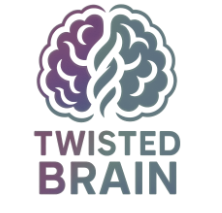

<div align="center">
  
</div>

# TwistedBrain HashLink Demo

A simple OpenFL Haxe demo application for HashLink VM showcasing TwistedBrain graphics.

## Features

- Interactive logo display with click-to-cycle functionality
- Uses TwistedBrain logo assets (tb.png, tb_2.png, tb_3.png, tb_4.png, tb_5.png)
- Clean, simple UI with welcome text and instructions
- Built specifically for HashLink VM target

## Project Structure

```
TwistedBrainDemoHL/
├── project.xml              # OpenFL project configuration (HashLink target)
├── Source/
│   └── TwistedBrainDemoMain.hx  # Main application class
├── Assets/
│   ├── tb.png               # TwistedBrain logo variants
│   ├── tb_2.png
│   ├── tb_3.png
│   ├── tb_4.png
│   └── tb_5.png
└── Export/
    ├── hl/
    │   ├── obj/
    │   │   └── ApplicationMain.hl  # HashLink bytecode (HL/JIT)
    │   └── bin/
    │       └── *.hdll          # HashLink dynamic libraries
    └── hlc/                    # HashLink/C generated files
        └── ApplicationMain.c   # Generated C code for native compilation
```

## Requirements

- Haxe 4.3.7+
- OpenFL 9.4.1+
- Lime 8.2.2+
- HashLink VM installed (for HL/JIT)
- C compiler (gcc/clang) for native compilation (HL/C)

## Building & Deployment

### HashLink/JIT (Bytecode - Development)

Fast compilation for daily development:

1. Navigate to the project directory:
   ```bash
   cd TwistedBrainDemoHL
   ```

2. Build for HashLink bytecode:
   ```bash
   haxelib run openfl build hl
   ```

3. Run with HashLink VM:
   ```bash
   hl Export/hl/obj/ApplicationMain.hl
   ```

### HashLink/C (Native - Production)

Better performance for final releases:

1. Build for HashLink/C:
   ```bash
   haxelib run openfl build hl -hlc
   ```

2. Compile to native executable:
   ```bash
   gcc -O3 -o TwistedBrainDemo -std=c11 -I Export/hlc Export/hlc/ApplicationMain.c -lhl
   ```

3. Run native executable:
   ```bash
   ./TwistedBrainDemo
   ```

## Distribution Options

### HL/JIT Distribution
- Bundle the `.hl` bytecode file with HashLink runtime
- Requires HashLink VM on target system
- Smaller file size, cross-platform bytecode
- Good performance for most applications

### HL/C Distribution
- Compile to fully native executable
- No runtime dependencies required
- Best performance, suitable for commercial releases
- Platform-specific binaries (Windows .exe, macOS app, Linux binary)
- Used by commercial games like Northgard and Dead Cells

## Usage

- The application displays a welcome message and the first TwistedBrain logo
- Click anywhere on the screen to cycle through the different logo variants
- The application window is 800x600 pixels with a black background

## Development Notes

- Main class: `TwistedBrainDemoMain`
- Package: `com.twistedbrain.demo`
- Target FPS: 60
- Hardware acceleration enabled
- VSync enabled for smooth rendering

## Troubleshooting

### Missing lime.hdll Error

If you encounter "Failed to load library lime.hdll" when running HL/JIT:

1. Ensure Lime is installed from Git (not just Haxelib):
   ```bash
   haxelib git lime https://github.com/openfl/lime
   ```

2. Install required dependencies:
   ```bash
   haxelib install format
   haxelib install hxp
   ```

3. Rebuild Lime for HashLink:
   ```bash
   haxelib run lime rebuild hl
   ```

4. Clean rebuild your project:
   ```bash
   haxelib run openfl build hl -clean
   ```

### Performance Tips

- Use HL/JIT for development (faster compilation)
- Use HL/C for production releases (better performance)
- Enable hardware acceleration in project.xml
- Consider VSync settings based on target platform

## Assets

All logo assets are sourced from the TB-graphics collection and are automatically embedded in the application during build.

---

<div align="center">
  <em>Made in a AI:Human DevOps cooperation process</em>
</div>